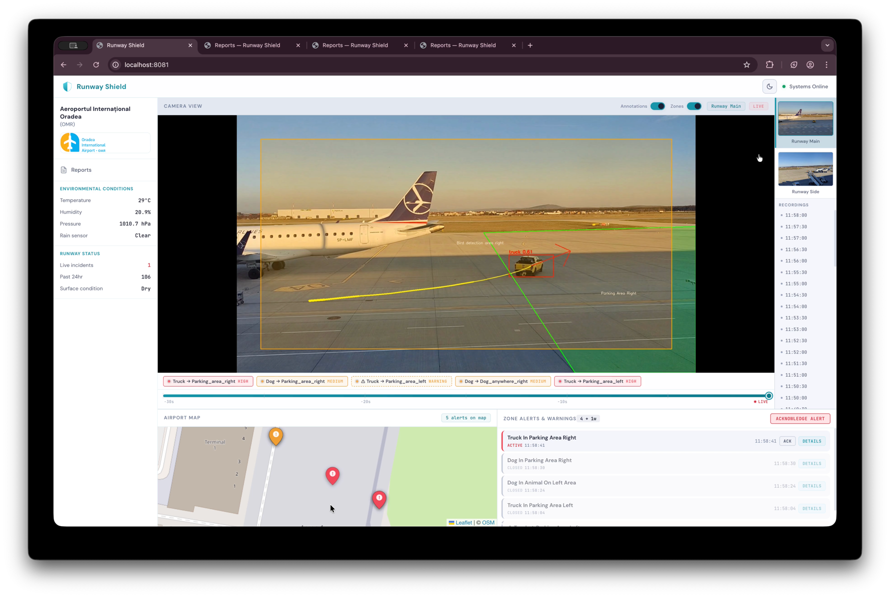

# Runway Shield

> Real-time runway hazard detection — built at HackTech Oradea 2026.

Runway Shield uses computer vision and object tracking to automatically detect birds, animals, people, and foreign object debris (FOD) on airport runways, alerting ground control in real time before accidents happen.

---

## Demo

<video src="docs/FINAL.mov" width="100%" controls></video>



Built at **HackTech Oradea 2026** — Challenge: *Automatic Hazard Detection*
`#MLSpecialists` `#ComputerVision` `#AerospaceEngineers`

---

## The Problem

Runway incursions — birds, stray animals, forgotten equipment — cause catastrophic accidents every year. Today, airports rely heavily on human eyes to patrol runways. This is slow, expensive, and error-prone, especially at night or in poor visibility.

**Runway Shield automates this entirely.**

---

## Features

- **Real-time object detection** — YOLO11 with ByteTrack multi-object tracking on live camera feeds
- **Configurable surveillance zones** — define polygon zones per camera with per-zone severity and alert rules
- **GPS coordinate mapping** — pixel detections projected to real-world GPS coordinates via camera calibration (homography)
- **Multi-camera support** — simultaneous live feeds from multiple runway cameras
- **Severity-tiered alerts** — low / medium / high, with per-zone action dispatch (e.g., buzzer trigger via MQTT)
- **Live WebSocket dashboard** — detections and alerts pushed to a React dashboard in real time
- **MQTT integration** — publish alerts to an IoT message broker to trigger physical actuators
- **ESP32 sensor integration** — connect hardware sensor nodes for additional environmental data
- **Camera emulator** — live and replay pre-recorded `.mp4` files as live MJPEG streams for testing without physical cameras
- **Persistent history** — detections, alerts, and notifications stored in SQLite

---

## Technical Stack

| Layer | Technology                                                                                               |
|---|----------------------------------------------------------------------------------------------------------|
| Object Detection | [Ultralytics YOLO11 / YOLO26](https://github.com/ultralytics/ultralytics) (yolo11n-seg, yolo26 variants) |
| Object Tracking | ByteTrack (via Ultralytics)                                                                              |
| Backend API | Python 3.11, Flask 3.1, Flask-SocketIO                                                                   |
| Production Server | Gunicorn (gthread, 1 worker, 16 threads)                                                                 |
| Camera Ingestion | OpenCV (`cv2`), MJPEG streams                                                                            |
| Messaging | MQTT (Paho), WebSockets (Socket.IO)                                                                      |
| Hardware | ESP32 sensor nodes                                                                                       |
| Frontend Dashboard | React 19, WebSockets                                                                                     |
| GPS Projection | Custom homography-based pixel → GPS mapping                                                              |
| Camera Emulator | Python + OpenCV MJPEG server                                                                             |
| Database | SQLite (via Python `sqlite3`)                                                                            |

---

## Architecture

```
┌─────────────────────────────┐   ┌──────────────────────────────┐
│        Video Sources        │   │    Environmental Sensors      │
│  Surveillance cameras       │   │  Temperature / Humidity /     │
│  Web cameras / USB cameras  │   │  Rain / other via ESP32      │
│  Drone footage              │   │                              │
│  MJPEG emulator (testing)   │   │                              │
└─────────────┬───────────────┘   └──────────────┬───────────────┘
              │ MJPEG stream                      │ HTTP / MQTT
              ▼                                   ▼
┌──────────────────────────────────────────────────────────────┐
│                     Backend (Flask)                          │
│                                                              │
│  CameraStream ──► Detector (YOLO11 + ByteTrack)             │
│                          │                                   │
│  ESP32 Sensor Client ────┤                                   │
│  (env data ingestion)    │                                   │
│                    ZoneChecker                               │
│                  (polygon hit-test + GPS projection)         │
│                          │                                   │
│                    AlertManager                              │
│                  (severity, dedup, dispatch)                 │
│                          │                                   │
│              ┌───────────┼────────────┐                      │
│          MQTT Broker      │     WebSocket (SocketIO)         │
└──────────────┬────────────┼───────────┬────────────────────┘
               │            │           │
        IoT Actuators   LED Lights   React Dashboard
     (buzzers, etc.)  (runway LEDs)  (live map + alert feed)
```

---

## Data Inputs

The system collects data from multiple sources:

- **Video feeds** — live streams from surveillance cameras, web cameras, and drone footage, ingested as MJPEG streams
- **Environmental sensors** — temperature, humidity, rain, and other compatible sensors connected via ESP32 nodes over HTTP/MQTT
- **LED lighting controls** — LED lights installed near the runway can be activated when a threat is detected; currently supports a single indicator, expandable to multiple lights with dynamic control

---

## Getting Started

### Prerequisites

- Python 3.10+
- Node.js 18+
- (Optional) Docker for Dev Container

### App

```bash
cd backend
pip install -r requirements.txt
./run.sh          # production (gunicorn on :8081)
# or
python app.py     # dev server with hot reload
```

### Camera Emulator (for testing without physical cameras)

```bash
cd cam_emulator
pip install -r requirements.txt
./run.sh     # serves test .mp4 files as MJPEG streams on :8554
```

Point the backend at the emulator:
```bash
CAMERA_1_URL=http://localhost:8554/video python app.py
```

### MQTT Broker

```bash
cd backend
./run_mqtt_broker.sh   # starts Mosquitto with local config
```

---

## Zone Configuration

Zones are defined in `backend/zones.json`. Each camera can have multiple polygonal zones with independent alert rules:

```json
{
  "camera_1": {
    "gps_corners": {
      "top_left":     {"px": [0, 463],    "gps": [47.028247, 21.901027]},
      "bottom_right": {"px": [1920, 1080],"gps": [47.028134, 21.899483]}
    },
    "zones": [
      {
        "id": "runway_critical",
        "name": "Runway Critical Zone",
        "polygon": [[200, 400], [1700, 400], [1700, 900], [200, 900]],
        "severity_override": "high",
        "action": "buzzer"
      }
    ]
  }
}
```

---

## API Reference

| Method | Path | Description |
|---|---|---|
| `GET` | `/api/status` | System status and camera states |
| `GET` | `/api/cameras` | List active cameras |
| `GET` | `/api/detections` | Recent detections with GPS coords |
| `GET` | `/api/alerts` | Recent alerts |
| `GET` | `/api/stream/<camera_id>` | Live MJPEG stream with YOLO overlay |
| `POST` | `/api/cameras/<id>/start` | Start a camera |
| `POST` | `/api/cameras/<id>/stop` | Stop a camera |
| `GET` | `/api/notifications/history` | Alert history |

WebSocket events are emitted on `detection` and `alert` channels via Socket.IO.

---

## Ports

| Service | Port |
|---|---|
| Backend API | 8081 |
| Camera Emulator | 8554 |
| MQTT Broker | 1883 |

---

## Environment Variables

| Variable | Default | Description |
|---|---|---|
| `CAMERA_1_URL` | `0` (webcam) | Camera 1 stream URL or device index |
| `CAMERA_2_URL` | `http://...` | Camera 2 MJPEG stream URL |
| `YOLO_MODEL_PATH` | `yolo11n-seg.pt` | Path to YOLO model weights |
| `MQTT_BROKER_HOST` | `localhost` | MQTT broker hostname |
| `MQTT_BROKER_PORT` | `1883` | MQTT broker port |
| `PORT` | `8081` | Server listen port |
| `WORKERS` | `1` | Gunicorn workers (keep at 1) |
| `THREADS` | `16` | Gunicorn threads |

---

## Project Structure

```
backend/
  app.py               Flask API server + Socket.IO
  camera.py            Camera capture thread
  detector.py          YOLO11 + ByteTrack wrapper
  zone_checker.py      Polygon zone hit-test + GPS projection
  alert_manager.py     Alert dedup, severity, action dispatch
  mqtt_client.py       MQTT publisher
  esp_sensor_client.py ESP32 sensor integration
  detections_db.py     SQLite detections store
  alerts_db.py         SQLite alerts store
  notifications_db.py  SQLite notifications store
  zones.json           Zone + GPS calibration config
  run.sh               Gunicorn startup script
  run_mqtt_broker.sh   Mosquitto startup script
cam_emulator/
  emulator.py          MJPEG emulator server
models_testing/        Standalone ML experiments
esp/                   ESP32 firmware / config
```

---

## Future Improvements

- **Trajectory pre-alert** — warn before an object enters a critical zone based on movement vector
- **Telegram bot** — push critical alerts directly to ground control staff phones
- **VLM reasoning** — use past detection history to predict likely threats
- **External data fusion** — cross-reference employee GPS data to reduce false positives
- **LiDAR integration** — depth sensing for fog and night conditions
- **Custom training** — fine-tune on airport-specific datasets (debris, ground vehicles, local bird species)
- **Restricted area photo detection** — detect person + phone combinations near sensitive areas using a Grounding DINO model
- **Multi-LED runway lighting** — dynamically activate specific runway LED segments closest to the detected threat
- **Weather-aware detection** — adjust detection thresholds and alert severity based on real-time environmental sensor data
- **ADS-B correlation** — ingest aircraft transponder data to suppress alerts during expected operations
- **Historical heatmaps** — aggregate detection data over time to identify recurring hotspots and seasonal patterns

